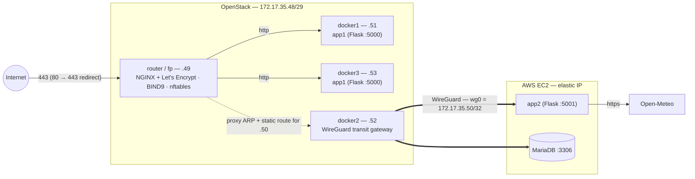

# WeatherTrip API

A multi-tier weather trip planner: a Flask REST API backed by MariaDB, with weather data delegated to a second Flask service that queries [Open-Meteo](https://open-meteo.com/). Originally deployed in Spring 2026 across OpenStack and AWS as the final project for a senior cloud infrastructure course at Miami University — five VMs, an NGINX load balancer with Let's Encrypt TLS, authoritative BIND9 DNS, an nftables firewall, and a WireGuard tunnel carrying all database and weather traffic to EC2.

The course VMs were ephemeral and are gone. This repository was reconstructed from the only surviving artifacts: the Docker images published to Docker Hub during the original deployment. Application source was extracted byte-for-byte from the image layers, the Dockerfiles were rebuilt from layer history, and the runtime contract (environment variables, ports, bind addresses) was recovered from image metadata. See [Provenance](#provenance) below.

## Architecture

Original production topology:



Three services:

| Service | Role |
|---|---|
| **app1** | REST API. Handles all client requests, owns the database, calls app2 for anything weather-related. Two replicas behind NGINX. |
| **app2** | Stateless weather proxy. Accepts queries from app1, calls Open-Meteo, shapes the response. No database, no configuration. |
| **db** | MariaDB 11.8 with the schema baked into the image via `init.sql`. Ships empty by design — demo data is seeded through the API. |

In production, app2 and the database lived on EC2 and were reachable *only* over the WireGuard tunnel: the EC2 security group admitted UDP 51820 and nothing else, and both services bound exclusively to the tunnel address (MariaDB via `bind.cnf`, app2 hardcoded in source). If the tunnel was down, neither service had a network presence at all. The reasoning is written up in [docs/design-decisions.md](docs/design-decisions.md).

## Running it

The compose file reproduces the application tier and its security invariants on a single machine: NGINX is the only published port, both app1 replicas are load balanced, and the containers sit on an isolated bridge using the original `172.17.35.48/29` addressing (app2 must own `.50` — its bind address is hardcoded, unmodified from the recovered source).

```bash
git clone https://github.com/jwklein/weathertrip-api.git
cd weathertrip-api
cp .env.example .env        # set real passwords
docker compose up -d --build
```

First boot takes a few seconds longer while MariaDB initializes the schema; app1 waits on the database healthcheck. Then:

```bash
# seed demo data
curl -X POST localhost:8080/api/admin/reset-demo-data \
  -H 'Content-Type: application/json' -d '{"confirm":true}'

curl localhost:8080/api/locations
```

Repeated requests alternate between the two app1 replicas — the `X-Upstream` response header shows `.51` and `.53` trading off.

If compose fails with `Pool overlaps with other one on this address space`, another Docker network already occupies part of `172.17.0.0/16`. Either remove it (`docker network prune`) or move Docker's default allocation range in `/etc/docker/daemon.json`:

```json
{ "default-address-pools": [ { "base": "10.200.0.0/16", "size": 24 } ] }
```

A full request/response transcript of every endpoint, captured from this stack, is in [docs/transcript-local.txt](docs/transcript-local.txt).

## API

| Method | Path | Description |
|---|---|---|
| GET | `/api/locations` | List saved locations |
| GET | `/api/locations/<id>` | One location |
| POST | `/api/locations` | Create a location (name unique, lat/lon validated) |
| GET | `/api/weather/current/<id>` | Near-term forecast for a location |
| GET | `/api/trips` | List trips |
| GET | `/api/trips/<id>` | Trip plus a 7-day forecast for its location |
| POST | `/api/trips` | Create a trip (dates validated, title unique) |
| POST | `/api/trips/<id>/note` | Append or overwrite a trip note |
| POST | `/api/admin/reset-demo-data` | Clear and reseed demo data |
| GET | `/api/locations/<id>/extremes?years=N` | Historical extremes (see below) |

`/extremes` queries Open-Meteo's historical reanalysis archive and returns the hottest, coldest, wettest, snowiest, and windiest day at a location over the last N years (default 10):

```json
{
  "location": "Oxford, OH",
  "period": { "start": "2021-07-09", "end": "2026-07-09" },
  "extremes": {
    "coldest_day":  { "date": "2022-12-23", "value": -24.7 },
    "hottest_day":  { "date": "2022-06-14", "value": 34.0 },
    "snowiest_day": { "date": "2026-01-25", "value": 21.56 },
    "wettest_day":  { "date": "2024-09-27", "value": 62.3 },
    "windiest_day": { "date": "2024-09-27", "value": 99.7 }
  }
}
```

### Configuration

app1 reads its full configuration from the environment; app2 takes none.

| Variable | Used by | Description |
|---|---|---|
| `MYSQL_HOST` / `MYSQL_PORT` | app1 | Database address (port defaults to 3306) |
| `MYSQL_USER` / `MYSQL_PASSWORD` / `MYSQL_DB` | app1, db | Credentials and database name |
| `MARIADB_ROOT_PASSWORD` | db | Root password for first-boot initialization |
| `WEATHER_HOST` / `WEATHER_PORT` | app1 | Where to find app2 (port defaults to 5001) |

## Repository layout

```
app1/       REST API — source recovered from kleinjw2/final-app1, Dockerfile rebuilt from layer history
app2/       weather proxy — recovered from kleinjw2/final-app2
db/         MariaDB image build: init.sql schema + bind.cnf, recovered from kleinjw2/617final-db
nginx/      load balancer config for the compose profile
infra/      the production network layer, reconstructed as reference configs:
            nftables ruleset, netplan, BIND9 zone, WireGuard peer configs, router NGINX (TLS)
docs/       design decisions, API transcript
```

`infra/` is documentation, not runtime: those configs lived on the OpenStack router and are preserved here as reconstructions from development notes. The compose profile reproduces what the network layer *enforced* — single ingress, workloads unreachable except through the front door, weather/db traffic on a private segment — through Docker-native mechanisms instead. What translated and what didn't is covered in the design notes.

A second compose profile that restores the AWS half for real — EC2, the WireGuard tunnel, and the original bind addresses untouched — is planned; the local profile exists so the system runs from a clone with no cloud account.

## Provenance

Everything here descends from three public Docker Hub images: [`kleinjw2/final-app1`](https://hub.docker.com/r/kleinjw2/final-app1), [`kleinjw2/final-app2`](https://hub.docker.com/r/kleinjw2/final-app2), and [`kleinjw2/617final-db`](https://hub.docker.com/r/kleinjw2/617final-db), pushed during the original May 2026 deployment.

Recovery method: source files extracted with `docker create` + `docker cp`; Dockerfiles reconstructed from `docker history --no-trunc` (the boundary between my layers and the base image's is unambiguous); environment contract and entrypoints from `docker image inspect`; exact dependency versions frozen from inside the images into `requirements.lock.txt` in each app directory. The rebuilt images were verified against the originals. They have th same startup behavior, same failure modes, same bind addresses.

One footnote: within days of publication the images had accumulated dozens of pulls from what were almost certainly bots scanning public registries for baked-in credentials. There were none to find, since all secrets were passed at runtime, which is also the only reason these images were safe to leave public long enough to become the project's accidental archive.

Exercising the recovered code end-to-end surfaced two latent bugs that survived the original deployment (an `AUTO_INCREMENT` assumption in the demo seeder and a missing `UNIQUE` constraint that left a duplicate-handling path dead). Both are fixed in this repository's history with the archaeology in the commit messages, and detailed in the design notes.

